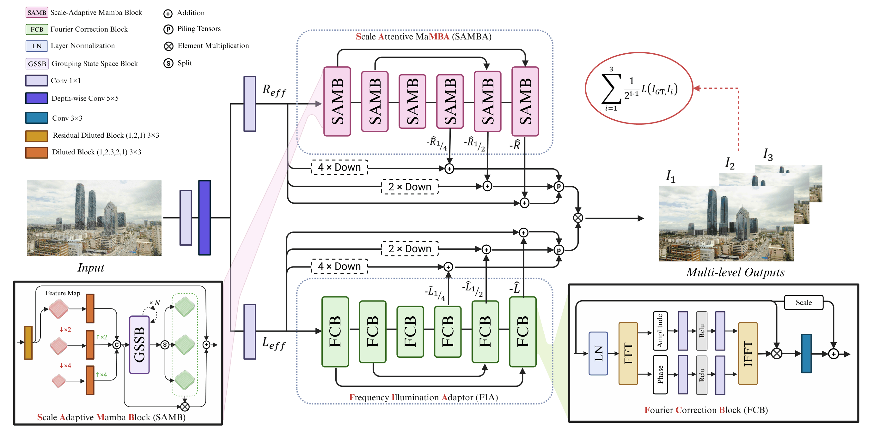

<p align="center">
  
</p>

# [ICPR26] RetinexDual: Retinex-based Dual Nature Approach for Generalized Ultra-High-Definition Image Restoration

<p align="center">
  <a href="https://arxiv.org/pdf/2508.04797.pdf">
    
  </a>
</p>

<p align="center">
  <a href="https://errorlogic1211.github.io/">Mohab Kishawy</a>,
  <a href="https://orcid.org/0009-0002-5084-3420">Ali Abdellatif Hussein</a>,
  <a href="https://www.ece.mcmaster.ca/~junchen/">Jun Chen</a>
</p>

> **Abstract:** Advancements in image sensing have elevated the importance of Ultra-High-Definition Image Restoration (UHD IR). Traditional methods, such as extreme downsampling or transformation from the spatial to the frequency domain, encounter significant drawbacks: downsampling induces irreversible information loss in UHD images, while our frequency analysis reveals that pure frequency-domain approaches are ineffective for spatially confined image artifacts, primarily due to the loss of degradation locality. To overcome these limitations, we present RetinexDual, a novel Retinex theory-based framework designed for generalized UHD IR tasks. RetinexDual leverages two complementary sub-networks: the Scale-Attentive maMBA (SAMBA) and the Frequency Illumination Adaptor (FIA). SAMBA, responsible for correcting the reflectance component, utilizes a coarse-to-fine mechanism to overcome the causal modeling of mamba, which effectively reduces artifacts and restores intricate details. On the other hand, FIA ensures precise correction of color and illumination distortions by operating in the frequency domain and leveraging the global context provided by it. Evaluating RetinexDual on four UHD IR tasks, namely deraining, deblurring, dehazing, and Low-Light Image Enhancement (LLIE), shows that it outperforms recent methods qualitatively and quantitatively. Ablation studies demonstrate the importance of employing distinct designs for each branch in RetinexDual, as well as the effectiveness of its various components.

<br>

## Overview

<p align="center">
  
</p>


# [CVPRW26] RetinexDualV2: RetinexDualV2: Physically-Grounded Dual Retinex for Generalized UHD Image Restoration
<p align="center">
  <a href="https://arxiv.org/pdf/2603.27979.pdf">
    
  </a>
</p>

<p align="center">
  <a href="https://errorlogic1211.github.io/">Mohab Kishawy</a>,
  <a href="https://www.ece.mcmaster.ca/~junchen/">Jun Chen</a>
</p>


> **Abstract:** We propose RetinexDualV2, a unified, physically grounded dual-branch framework for diverse Ultra-High-Definition (UHD) image restoration. Unlike generic models, our method employs a Task-Specific Physical Grounding Module (TS-PGM) to extract degradation-aware priors (e.g., rain masks and dark channels). These explicitly guide a Retinex decomposition network via a novel Physical-conditioned Multi-head Self-Attention (PC-MSA) mechanism, enabling robust reflection and illumination correction. This physical conditioning allows a single architecture to handle various complex degradations seamlessly, without task-specific structural modifications. RetinexDualV2 demonstrates exceptional generalizability, securing 4\textsuperscript{th} place in the NTIRE 2026 Day and Night Raindrop Removal Challenge and 5\textsuperscript{th} place in the Joint Noise Low-light Enhancement (JNLLIE) Challenge. Extensive experiments confirm the state-of-the-art performance and efficiency of our physically motivated approach.

<br>

## Overview

<p align="center">
  
</p>


**🚧 Update:** The source code and pre-trained models will be released soon. Please stay tuned!


## Citation

If you find our work useful in your research, please consider citing our papers:

### RetinexDual (ICPR 2026)
```bibtex
@article{kishawy2025retinexdual,
  title={RetinexDual: Retinex-based Dual Nature Approach for Generalized Ultra-High-Definition Image Restoration},
  author={Kishawy, Mohab and Hussein, Ali Abdellatif and Chen, Jun},
  journal={arXiv preprint arXiv:2508.04797},
  year={2025}
}
```

### RetinexDualV2 (CVPRW 2026)
```bibtex
@inproceedings{kishawy2026retinexdualv2,
  title={RetinexDualV2: Physically-Grounded Dual Retinex for Generalized UHD Image Restoration},
  author={Kishawy, Mohab and Chen, Jun},
  booktitle={Proceedings of the IEEE/CVF Conference on Computer Vision and Pattern Recognition Workshops (CVPRW)},
  year={2026}
}
```