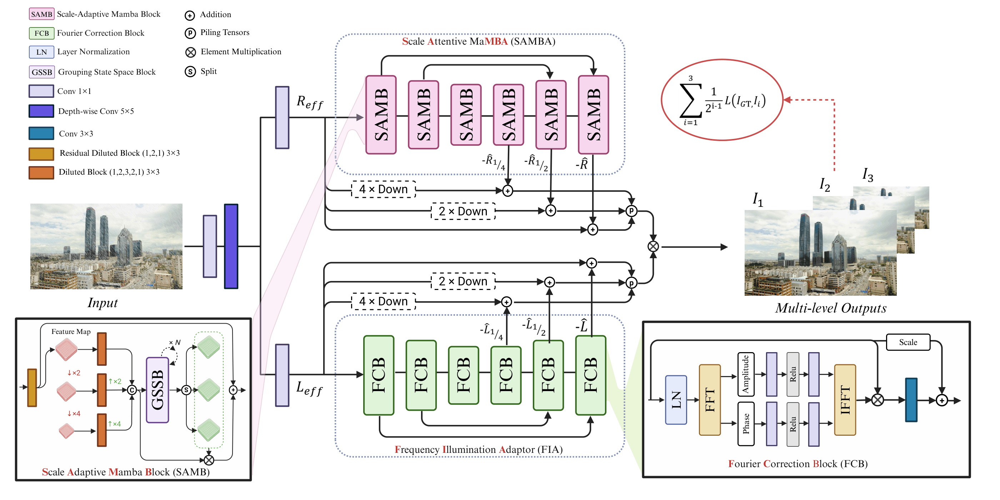

<p align="center">
  
</p>

# [ICPR26] RetinexDual: Retinex-based Dual Nature Approach for Generalized Ultra-High-Definition Image Restoration

<p align="center">
  <a href="https://arxiv.org/pdf/2508.04797.pdf">
    
  </a>
  <a href="https://huggingface.co/ErrorLogic/RetinexDual">
    
  </a>
</p>

<p align="center">
  <a href="https://errorlogic1211.github.io/">Mohab Kishawy</a>,
  <a href="https://orcid.org/0009-0002-5084-3420">Ali Abdellatif Hussein</a>,
  <a href="https://www.ece.mcmaster.ca/~junchen/">Jun Chen</a>
</p>

> **Abstract:** Advancements in image sensing have elevated the importance of Ultra-High-Definition Image Restoration (UHD IR). Traditional methods, such as extreme downsampling or transformation from the spatial to the frequency domain, encounter significant drawbacks: downsampling induces irreversible information loss in UHD images, while our frequency analysis reveals that pure frequency-domain approaches are ineffective for spatially confined image artifacts, primarily due to the loss of degradation locality. To overcome these limitations, we present RetinexDual, a novel Retinex theory-based framework designed for generalized UHD IR tasks. RetinexDual leverages two complementary sub-networks: the Scale-Attentive maMBA (SAMBA) and the Frequency Illumination Adaptor (FIA). SAMBA, responsible for correcting the reflectance component, utilizes a coarse-to-fine mechanism to overcome the causal modeling of mamba, which effectively reduces artifacts and restores intricate details. On the other hand, FIA ensures precise correction of color and illumination distortions by operating in the frequency domain and leveraging the global context provided by it. Evaluating RetinexDual on four UHD IR tasks, namely deraining, deblurring, dehazing, and Low-Light Image Enhancement (LLIE), shows that it outperforms recent methods qualitatively and quantitatively. Ablation studies demonstrate the importance of employing distinct designs for each branch in RetinexDual, as well as the effectiveness of its various components.

<br>

## Overview

<p align="center">
  
</p>

RetinexDual decomposes the input into reflectance and illumination, then restores each with a dedicated branch:

- **SAMBA** (Scale-Attentive maMBA) — restores the **reflectance** component with a coarse-to-fine, multi-scale state-space (Mamba) design that suppresses artifacts and recovers fine detail.
- **FIA** (Frequency Illumination Adaptor) — corrects **illumination/color** in the frequency domain, exploiting global context.

The same architecture is trained for four UHD restoration tasks: **Low-Light Enhancement, Deraining, Deblurring, and Dehazing**.

## News

- **2026-06** : Code and pre-trained models are released. 🎉

## Installation

The code is tested with **Python 3.9**, **PyTorch 2.7.1**, and **CUDA ≥ 11.8** (Linux recommended).

```bash
# 1. Create the environment
conda create -n retinexdual python=3.9 -y
conda activate retinexdual

# 2. Install all dependencies (PyTorch, mamba-ssm, causal-conv1d, etc.)
pip install -r requirements.txt

# 3. Install this codebase (BasicSR) in develop mode
python setup.py develop --no_cuda_ext
```

`requirements.txt` pins the exact tested versions. `mamba-ssm` and `causal-conv1d` ship compiled CUDA
kernels and need a CUDA toolkit + C/C++ build tools; if pip cannot find a matching prebuilt wheel,
install a `torch` / `mamba-ssm` combination that matches your CUDA version first.

> **Running without the Mamba CUDA kernels.** SAMBA only uses `selective_scan_fn` from
> [`mamba-ssm`](https://github.com/state-spaces/mamba). On a machine where those kernels cannot be built,
> you can drop in a pure-PyTorch `mamba_ssm/ops/selective_scan_interface.py` that defines `selective_scan_ref`
> (and aliases `selective_scan_fn` to it); it is numerically equivalent, just slower.

## Datasets

We use the four standard UHD restoration benchmarks. Download each task's dataset and place it under `datasets/`:

| Task | Dataset | Download |
|------|---------|----------|
| Low-Light Enhancement | **UHD-LL** | [Google Drive](https://drive.google.com/drive/folders/1IneTwBsSiSSVXGoXQ9_hE1cO2d4Fd4DN) |
| Dehazing | **UHD-Haze** | [Google Drive](https://drive.google.com/drive/folders/1PVCPkhqU_voPVFZj3FzAtUkJnQnF9lSa) |
| Deblurring | **UHD-Blur** | [Google Drive](https://drive.google.com/drive/folders/1O6JYkOELLhpEkirAnxUB2JGWMqgwVvmX) |
| Deraining | **4K-Rain13k** | [Baidu Disk](https://pan.baidu.com/share/init?surl=Kao-OjWNlgg2Jl0Jtl7e5Q&pwd=spfi) (`pwd: spfi`) |

Expected folder layout (matching the paths in `Enhancement/Options/*.yml`):

```
datasets/
├── UHD-LL/
│   ├── training_set/{input,gt}
│   └── testing_set/{input,gt}
├── UHD-Blur/
│   ├── train/{input_new,gt_new}
│   └── test/{input300,gt300}
├── UHD-Haze/
│   ├── train/{input,gt}
│   └── test/{input,gt}
└── 4K-Rain13K/
    ├── train/{input,target}
    └── test/{input,target}
```

If your folders differ, just edit `dataroot_lq` / `dataroot_gt` in the relevant config.

## Pre-trained Weights

Pre-trained models for all four tasks are available on Hugging Face:
**[ErrorLogic/RetinexDual](https://huggingface.co/ErrorLogic/RetinexDual)**

| Task | Weight file |
|------|-------------|
| Low-Light Enhancement | `UHD_LL.pth` |
| Deblurring | `UHD_Blur.pth` |
| Dehazing | `UHD_Haze.pth` |
| Deraining | `4K_Rain13K.pth` |

Download them and place them under `pretrained_weights/`:

```
pretrained_weights/
├── UHD_LL.pth
├── UHD_Blur.pth
├── UHD_Haze.pth
└── 4K_Rain13K.pth
```

## Inference

Run the standalone inference script on a folder (or a single image). Ground truth is optional —
omit `-g` to simply enhance images, or pass it to also report PSNR / SSIM / LPIPS.

```bash
# Enhance a folder of images (no ground truth needed)
python inference_RetinexDual.py \
    -i path/to/input_images \
    -w pretrained_weights/UHD_LL.pth \
    -o results/UHD-LL

# With ground truth, to also compute PSNR / SSIM / LPIPS
python inference_RetinexDual.py \
    -i path/to/input_images \
    -g path/to/gt_images \
    -w pretrained_weights/UHD_LL.pth \
    -o results/UHD-LL
```

Swap the weight file (`UHD_Blur.pth` / `UHD_Haze.pth` / `4K_Rain13K.pth`) to run the other tasks.

## Training

Set the dataset paths in the corresponding config under `Enhancement/Options/`, then launch training.

```bash
# Single GPU (set `num_gpu: 1` in the .yml)
python basicsr/train.py -opt Enhancement/Options/RetinexDuelSambaFusionFinalized.yml

# Multiple GPUs (e.g. GPUs 0,1,2 ; last arg is the master port)
bash train_multiGPU.sh Enhancement/Options/RetinexDuelSambaFusionFinalized.yml 0,1,2 4321
```

Configs for each task:

| Task | Config |
|------|--------|
| Low-Light Enhancement | `Enhancement/Options/RetinexDuelSambaFusionFinalized.yml` |
| Deblurring | `Enhancement/Options/RetinexDuelSambaFusionFinalizedDeblur.yml` |
| Dehazing | `Enhancement/Options/RetinexDuelSambaFusionFinalizedDehaze.yml` |
| Deraining | `Enhancement/Options/RetinexDuelSambaFusionFinalizedDerain.yml` |

Checkpoints, logs, and validation images are written to `experiments/<config-name>/`.
Adjust `num_gpu`, `batch_size_per_gpu`, and `gt_size` to fit your hardware.

## Acknowledgements

This codebase is built upon [BasicSR](https://github.com/XPixelGroup/BasicSR),
[Restormer / MIRNet-v2](https://github.com/swz30/MIRNetv2) (progressive training),
[UHDM](https://github.com/CVMI-Lab/UHDM), [Mamba](https://github.com/state-spaces/mamba),
and we also thank [ERR](https://github.com/NJU-PCALab/ERR) for the UHD restoration benchmarks and references.
We thank the authors for their excellent work.

## Citation

If you find our work useful in your research, please consider citing our paper:

```bibtex
@article{kishawy2025retinexdual,
  title={RetinexDual: Retinex-based Dual Nature Approach for Generalized Ultra-High-Definition Image Restoration},
  author={Kishawy, Mohab and Hussein, Ali Abdellatif and Chen, Jun},
  journal={arXiv preprint arXiv:2508.04797},
  year={2025}
}
```
