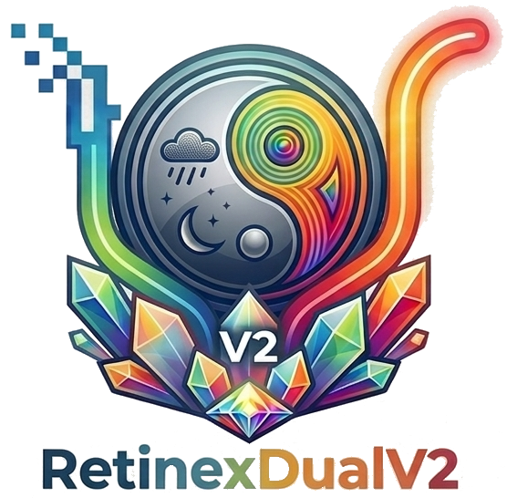
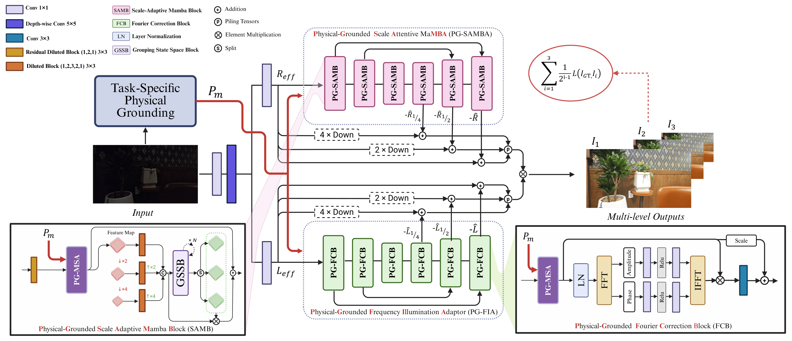

<p align="center">
  
</p>

# RetinexDualV2: Physically-Grounded Dual Retinex for Generalized UHD Image Restoration
<p align="center">
  <a href="https://arxiv.org/pdf/2603.27979.pdf">
    
  </a>
</p>

<p align="center">
  <a href="https://errorlogic1211.github.io/">Mohab Kishawy</a>,
  <a href="https://www.ece.mcmaster.ca/~junchen/">Jun Chen</a>
</p>


> **Abstract:** We propose RetinexDualV2, a unified, physically grounded dual-branch framework for diverse Ultra-High-Definition (UHD) image restoration. Unlike generic models, our method employs a Task-Specific Physical Grounding Module (TS-PGM) to extract degradation-aware priors (e.g., rain masks and dark channels). These explicitly guide a Retinex decomposition network via a novel Physical-conditioned Multi-head Self-Attention (PC-MSA) mechanism, enabling robust reflection and illumination correction. This physical conditioning allows a single architecture to handle various complex degradations seamlessly, without task-specific structural modifications. RetinexDualV2 demonstrates exceptional generalizability, securing 4\textsuperscript{th} place in the NTIRE 2026 Day and Night Raindrop Removal Challenge and 5\textsuperscript{th} place in the Joint Noise Low-light Enhancement (JNLLIE) Challenge. Extensive experiments confirm the state-of-the-art performance and efficiency of our physically motivated approach.

<br>

## Overview

<p align="center">
  
</p>


**🚧 Update:** The source code and pre-trained models will be released soon. Please stay tuned!


## Citation

If you find our work useful in your research, please consider citing our papers:

### RetinexDualV2
```bibtex
@inproceedings{kishawy2026retinexdualv2,
  title={RetinexDualV2: Physically-Grounded Dual Retinex for Generalized UHD Image Restoration},
  author={Kishawy, Mohab and Chen, Jun},
  booktitle={Proceedings of the IEEE/CVF Conference on Computer Vision and Pattern Recognition Workshops (CVPRW)},
  year={2026}
}
```